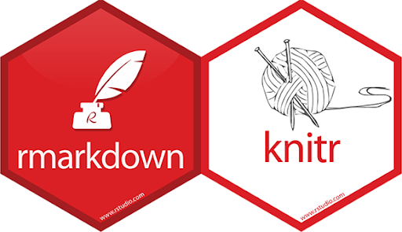
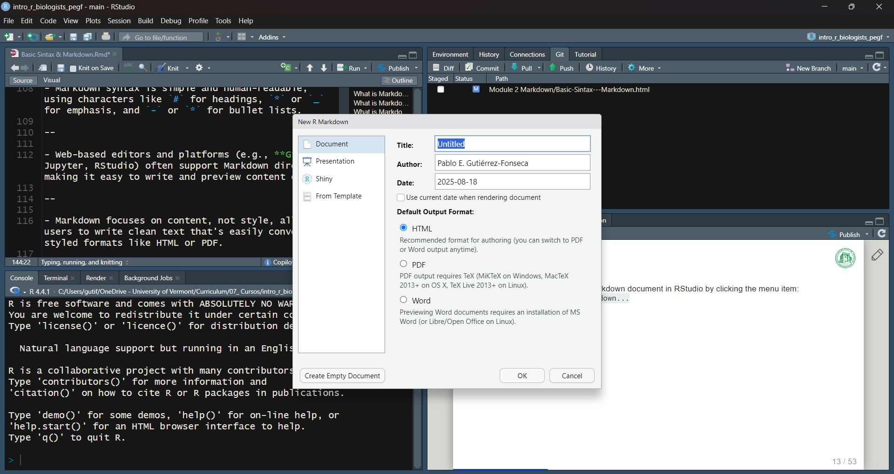
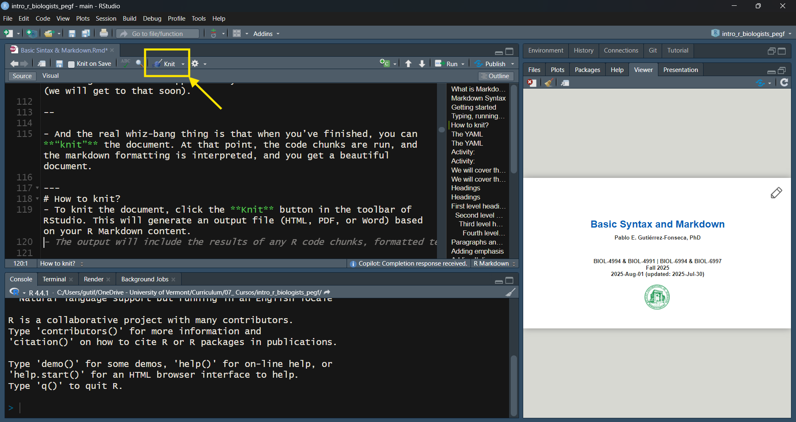
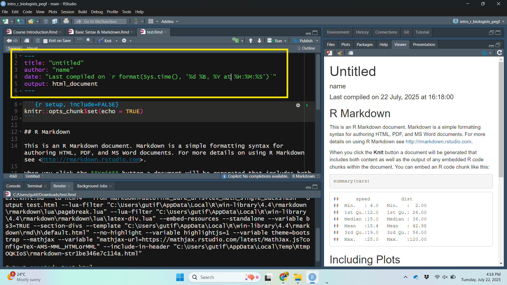
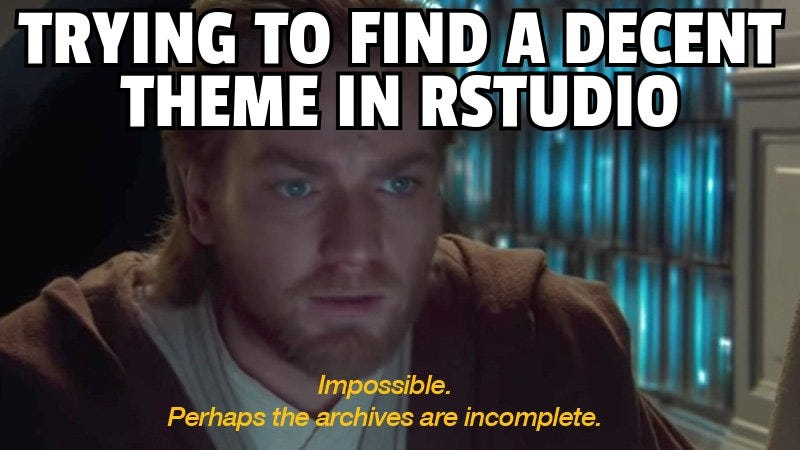
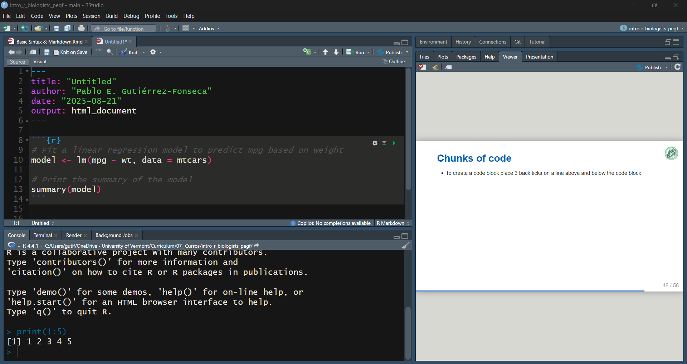
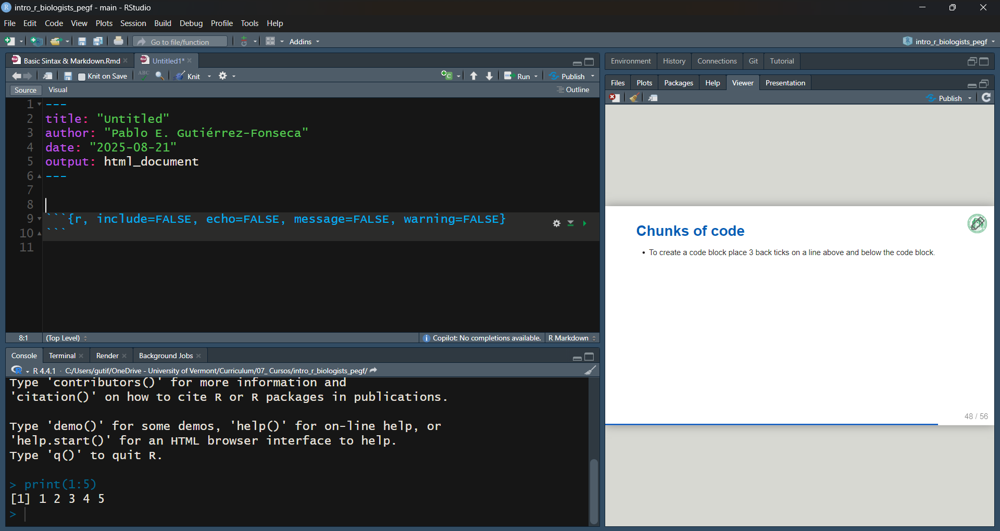

```{r, echo=FALSE, message=FALSE, warning=FALSE}
library(readxl)
library(dplyr)
library(readr)
library(lessR)
library(ggplot2)
library(ggpubr)
library(cowplot)
library(patchwork)
library(palmerpenguins)
library(car)
library(ggforce) # for geom_circle
library(RVAideMemoire) #shapiro.test
library(DiagrammeR)
#knitr::opts_chunk$set(dpi= 100)
xaringanExtra::use_panelset()
xaringanExtra::use_scribble()
xaringanExtra::use_search(show_icon = FALSE, position= "bottom-left") # Search
xaringanExtra::use_progress_bar(color = "#0051BA", location = "bottom", 
                                height = "4px")
xaringanExtra::use_clipboard() # Copy Code 
xaringanExtra::use_extra_styles(
  hover_code_line = TRUE,         #<<
  mute_unhighlighted_code = TRUE  #<<
)
xaringanExtra::use_editable(expires = 1) # Add textboxes to edit during presentation
```


<center>
<br><br><br><br><br><br><br>
```{r, echo=FALSE, fig.cap="", out.width = '40%'}

```
</center>

---
exclude: true
https://programminghistorian.org/en/lessons/getting-started-with-markdown

http://www3.biotech.wisc.edu/brc/workshop/SROP/tabr/13-markdownandreproducibleresearch.html

---
# What is Markdown?

- Markdown is a lightweight markup language (i.e., a language that uses simple symbols to format and organize text) created by John Gruber and Aaron Swartz in 2004, using ideas from Swartz's earlier ATX language, to format plain text files with an easy-to-read syntax.  

---
# What is Markdown?

- Markdown is a lightweight markup language (i.e., a language that uses simple symbols to format and organize text) created by John Gruber and Aaron Swartz in 2004, using ideas from Swartz's earlier ATX language, to format plain text files with an easy-to-read syntax.

- **Markdown is indeed a markup language, not a programming language.**
    - A **markup language** (like Markdown, HTML): used to structure and format text in a document. They provide instructions for how content should be displayed (headings, lists, bold text, links).
    - A **programming language** (like Python, Java): used to write instructions that a computer can execute to perform tasks, solve problems, or build applications.  

- Main difference:
    - Markdown formats and styles text, while programming languages tell computers what to do.


---
# What is Markdown?

- Markdown is a lightweight markup language (i.e., a language that uses simple symbols to format and organize text) created by John Gruber and Aaron Swartz in 2004, using ideas from Swartz's earlier ATX language, to format plain text files with an easy-to-read syntax.

--

- It allows users to create structured documents (like headings, lists, links, and emphasis) that are readable in plain text and can be converted to HTML or other formats.

--

- Markdown files are platform-independent and future-proof, making them ideal for sharing, editing, and preserving across systems.

--

- Widely supported across platforms, Markdown is used by GitHub, blogging tools, and site generators, and can be converted to other formats using tools like Pandoc.

---
# Markdown Syntax
- Markdown files use the `.md` extension and can be opened and edited with any plain text editor like Notepad, TextEdit, Sublime Text, or Vim.

--

- Markdown syntax is simple and human-readable, using characters like `#` for headings, `*` or `_` for emphasis, and `-` or `*` for bullet lists.

--

- Web-based editors and platforms (e.g., **GitHub**, Jupyter, RStudio) often support Markdown directly, making it easy to write and preview content online.

--

- Markdown focuses on content, not style, allowing users to write clean text that's easily converted to styled formats like HTML or PDF.

---
# Getting started
- You can create a new R Markdown document in RStudio by clicking the menu item:
  - `File` > `New File` > `R Markdown...`
- This will open a dialog box where you can enter the title, author, and select the output format (HTML, PDF, or Word).

<center>
```{r, echo=FALSE, fig.cap="", out.width = '60%'}

```
</center>

---
# Getting started with PDF output in R Markdown
- To render R Markdown documents to PDF, you need a LaTeX distribution installed.

- R provides an easy way to do this with the tinytex package, which installs TinyTeX, a lightweight version of LaTeX.

- Run the following commands in your R console (only once per computer setup):
```{r, eval=FALSE}
# Install the tinytex package
install.packages("tinytex")

# Install TinyTeX distribution (LaTeX engine)
tinytex::install_tinytex()
```

---
# Typing, running, and knitting
- When you type in an R Markdown document, you just get what you type.

--

- The magic starts to happen when you run **R code chunks** in the document (we will get to that soon).

  - **R code chunks** are sections of R code that can be executed within the document, allowing you to include results, plots, and analyses directly in your text.
  - The keyboard shortcut Ctrl + Alt + I (OS X: Cmd + Option + I)
  - or Add Chunk command in the editor toolbar
    
    
---
# Typing, running, and knitting
- When you type in an R Markdown document, you just get what you type.

- The magic starts to happen when you run **R code chunks** in the document (we will get to that soon).

--

- And the real _neat_ thing is that when you’ve finished, you can **“knit”** the document. At that point, the code chunks are run, and the markdown formatting is interpreted, and you get a beautiful document.

---
# How to knit? 
- To knit the document, click the **Knit** button in the toolbar of RStudio. This will generate an output file (HTML, PDF, or Word) based on your R Markdown content.

<center>
```{r, echo=FALSE, fig.cap="", out.width = '60%'}

```
</center>

---
# The YAML
- When we started our new R markdown file, there is a chunk of text at the top that we’ve ignored so far. This is the YAML (which now stands for “YAML Ain’t Markup Language”.)

--

- The YAML contents gives us the opportunity to control what happens when we knit our document.

--

- For example, there are a variety of themes, which you can find listed at the [Jekyll Themes site](http://jekyllthemes.org).

---
# The YAML
- There are four default elements in the RStudio generated YAML header:
    - **title**: the title of your document. Note, this is not the same as the file name.
    - **author**: who wrote the document.
    - **date**: by default this is the date that the file is created.
    - **output**: what format will the output be in. We will use HTML.

<center>
```{r, echo=FALSE, fig.cap="", out.width = '40%'}

```
<center>

--

- A YAML header may be structured differently depending upon how your are using it. 

---
# Activity: 
- R Markdown YAML Customize the header of your `.Rmd` file as follows:
    - Title: **Provide a title** that fits the code that will be in your RMD.
    - Author: Add **your name** here.
    - Output: Leave the default output setting: **html_document**. We will be rendering an HTML file.

---
# Activity:
- R Markdown YAML

```{r eval=FALSE}
---
title: "Untitled"
author: "name"
date: "`r format(Sys.time(), '%Y-%b-%d, %I:%M %p')`"
output: html_document
---
```

---
# We will cover the following topics:

---
# We will cover the following topics:
- Heading
- Paragraphs and Line Breaks
- Emphasis (bold, italics)
- Lists (ordered and unordered)
- Links
- Images
- Tables
- Chunks of code (inline and blocks)


---
# Headings
Markdown supports four levels of headings, marked by one to four `#` symbols before the heading text. For example:
.pull-left[
```markdown
# First level heading
## Second level heading
### Third level heading
##### Fourth level heading
```]
.pull-right[
]

---
# Headings
Markdown supports four levels of headings, marked by one to four # symbols before the heading text. For example:
.pull-left[
```markdown
# First level heading
## Second level heading
### Third level heading
##### Fourth level heading
```]
.pull-right[
# First level heading
## Second level heading
### Third level heading
#### Fourth level heading
]

---
# Paragraphs and Line Breaks  
- A paragraph is made of consecutive lines of text separated by one or more blank lines.  
- To insert a line break within a paragraph, add `two spaces` at the end of the line or use `<br>` in HTML.

.pull-left[
```markdown
This is the first line.<br> 
This is the second line.
This is a new paragraph.
```
]

.pull-right[
This is the first line.<br>
This is the second line.
This is a new paragraph.
]

---
# Adding emphasis
Text can be bolded by wrapping the word in `**` or `__` symbols. 

.pull-left[
```markdown
I am **very** excited about the 
__class__ tutorials.
```]

.pull-right[
I am **very** excited about the 
__class__ tutorials.
]

---
# Adding Italics
- For text that you want to display in *italics*, use one underscore `_` or asterisk `*` before and after the word.

.pull-left[
```markdown
this *italics*
and this _italics_
```]

.pull-right[
this *italics*
and this _italics_
]


---
# Making Lists
- Markdown includes support for ordered and **unordered** lists. Try typing the following list into the textbox:

.pull-left[
```markdown
## Shopping List
- Fruits
  * Apples
  * Oranges
  * Grapes
- Dairy
  * Milk
  * Cheese
```]

.pull-right[
## Shopping List
- Fruits
  * Apples
  * Oranges
  * Grapes
- Dairy
  * Milk
  * Cheese
]

---
# Making Lists
- Unordered lists can use **asterisks** `*`, **pluses** `+`, or **hyphens** `-` as list markers.  
- All three styles work the same way, so you can choose the one you prefer.

---
# Making Lists
- Markdown includes support for **ordered** and unordered lists. Try typing the following list into the textbox:

.pull-left[
```markdown
## To-do list
1. Finish Markdown tutorial
2. Go to grocery store
3. Prepare lunch
```]

.pull-right[
## To-do list
1. Finish Markdown tutorial
2. Go to grocery store
3. Prepare lunch
]

---
# Links
Inline links are written by enclosing the link text in square brackets first, then including the URL and optional alt-text in round brackets.

```{r eval=FALSE}
[linking text](website address)
[Basic Syntax](https://www.markdownguide.org/basic-syntax/)
```

For more tutorials, please visit the [Basic Syntax](https://www.markdownguide.org/basic-syntax/).

---
# Images
- Images are similar to links, but with an exclamation mark `!` before the square brackets. The syntax is as follows:

1. 
```markdown

```

2. 
```markdown

```

3.
```{r, eval=FALSE, fig.cap="", out.width = '40%'}
knitr::include_graphics("image.png")
```


---
# Images
- Images are similar to links, but with an exclamation mark `!` before the square brackets. The syntax is as follows:

.pull-left[

]

.pull-right[

]


---
# Tables
- The core Markdown spec does not include tables; however, some sites and applications use variants of Markdown that may include tables and other special features. [GitHub Flavored Markdown](/"https://docs.github.com/en/get-started/writing-on-github") is one of these variants, and is used to render .md files in the browser on the GitHub site.

--

- To create a table within GitHub, use pipes `|` **to separate columns** and **hyphens** `-` between your **headings** and the rest of the table content. While pipes are only strictly necessary between columns, you may use them on either side of your table for a more polished look. Cells can contain any length of content, and it is not necessary for pipes to be vertically aligned with each other.

--

-  The **first row** typically contains the **column headers**, while subsequent rows contain the data.

---
# Tables

```markdown
| Heading 1 | Heading 2 | Heading 3 |
| --------- | --------- | --------- |
| Row 1, column 1 | Row 1, column 2 | Row 1, column 3|
| Row 2, column 1 | Row 2, column 2 | Row 2, column 3|
| Row 3, column 1 | Row 3, column 2 | Row 3, column 3|
```

---
# Tables
- Output will look like this:

| Heading 1 | Heading 2 | Heading 3 |
| --------- | --------- | --------- |
| Row 1, column 1 | Row 1, column 2 | Row 1, column 3|
| Row 2, column 1 | Row 2, column 2 | Row 2, column 3|
| Row 3, column 1 | Row 3, column 2 | Row 3, column 3|

---
# Tables
- To specify the alignment of each column, colons : can be added to the header row as follows:
```markdown
| Left-aligned | Centered | Right-aligned |
*| :-------- | :-------: | --------: |
| Apples | Red | 5000 |
| Bananas | Yellow | 75 |
```

---
# Tables
- Output will look like this:

| Left-aligned | Centered | Right-aligned |
| :-------- | :-------: | --------: |
| Apples | Red | 5000 |
| Bananas | Yellow | 75 |

---
# Chunks of code
- To create inline code, wrap with backticks `.
- When `x = 3`, that means `x + 2 = 5`

---
# Chunks of code
- To create a code block place 3 back ticks on a line above and below the code block.
<br><br>

<center>
```{r, echo=FALSE, fig.cap="", out.width = '60%'}

```
<center>

---
# Chunk Options
- Chunk output can be customized with **knitr options**, which are set in the {} of a chunk header.

```{r, echo=FALSE, fig.cap="", out.width = '50%'}

```
<br>
Common options:  
**include=FALSE** → runs code but hides both code & results (useful for setup).  
**echo=FALSE** → hides code, shows results (useful for plots).  
**message=FALSE** → hides messages from appearing in the final output.  
**warning=FALSE** → hides warnings from appearing in the final output.  

---
# Markdown Limitations

---
# Markdown Limitations
- While Markdown is becoming increasingly popular, particularly for styling documents that are viewable on the web, many people and publishers still expect traditional Word documents, PDFs, and other file formats.
    * Advanced word processor features like track changes are not yet fully supported.
    * Markdown does not support advanced formatting options like font size, color, or styles beyond basic emphasis and headings.

--

- Markdown is primarily designed for formatting text and does not support advanced features like complex tables, footnotes, or mathematical equations.

---
# So, why use Markdown?

- Connects your data, R code, and results in a single, readable document.  This creates a fully reproducible workflow where all your code and analysis steps are transparent and easy to follow.

--

- Supports multiple output formats (e.g., PDF, Word, HTML, slides, and more) from one source file, making collaboration and communication easier.

--

- Enhances research transparency. You can share your data and R Markdown files as supplementary material or host them on GitHub.

--

- Boosts efficiency. When your analysis changes, you just update the R Markdown file, the final document updates automatically.

---
# 

<br><br>

<center>
```{r, echo=FALSE, fig.cap="", out.width = '40%'}
knitr::include_graphics("fig/gif.gif")
```
<center>

